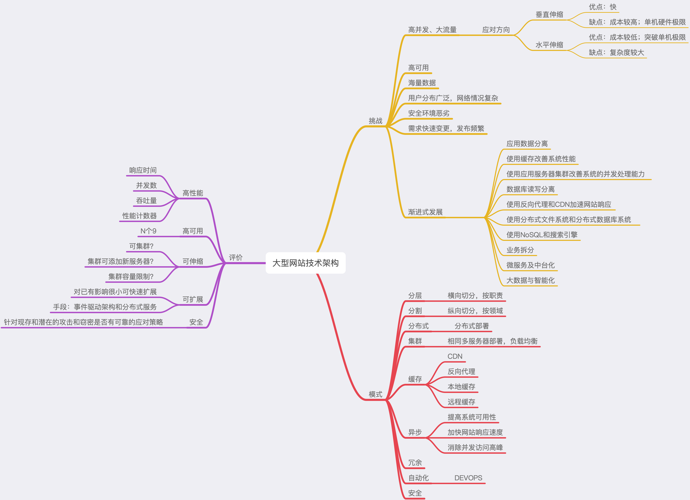
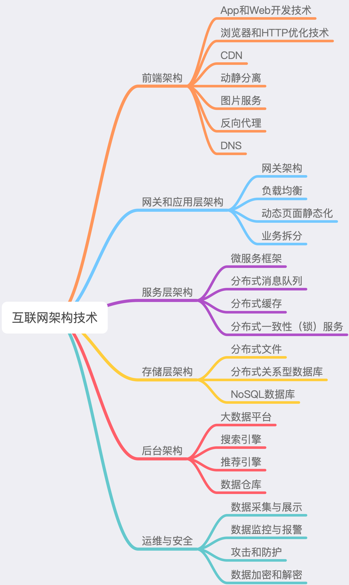

## 作业一

## 作业二
>   大型网站技术架构面临的挑战主要表现为高并发、大流量，高可用，海量数据处理，用户地域分布广泛、网络环境复杂，网络安全环境恶劣、需求快速
> 变更，发布频繁等挑战。
>   对于重复出现的上述类似问题采用主要9中架构模式进行应对，分层架构横向各层功能职责；分割架构纵向切分各业务领域问题；
> 基于分层分割进行分布式部署，突破单机硬件极限；集群架构部署相同应用进行负载均衡获得更多并发能力；缓存架构包括应对用户地域分布问题响应问
> 题的CDN，反向代理，本地缓存和远程缓存减少数据库处理压力大幅提升响应速度；异步架构应对应用服务之间的解耦，提高系统可用性，加快网站响应
> 速度，消除并发访问高峰；冗余架构应对宕机数据丢失等问题提升系统可用性；自动化架构主要应对分布式部署各服务之间的运维复杂度，提升运维管理
> 效率；安全架构应对现有的数据加密和攻击应对。
>   如何评价架构优劣问题？通过通用指标如响应时间，并发数，吞吐量，性能计数器来评价高性能目标；N个9指标来评价高可用目标；是否可集群，集群
> 是否可以便捷扩展新服务器提升集群整体算力，是否集群容量有限制来评价可伸缩目标；是否对已有影响很小情况下进行快速扩展来评价可扩展目标；是
> 否能够对现存和潜在的攻击和窃密有可靠的应对策略来评价安全目标。